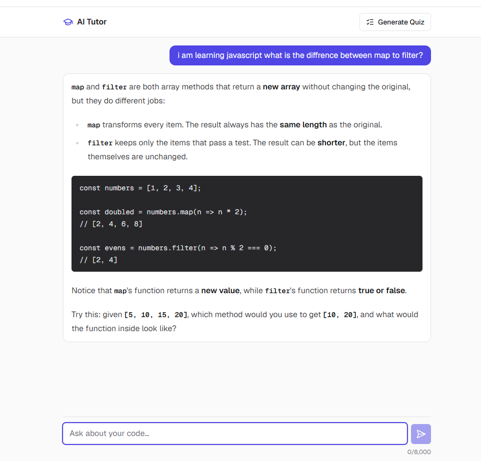
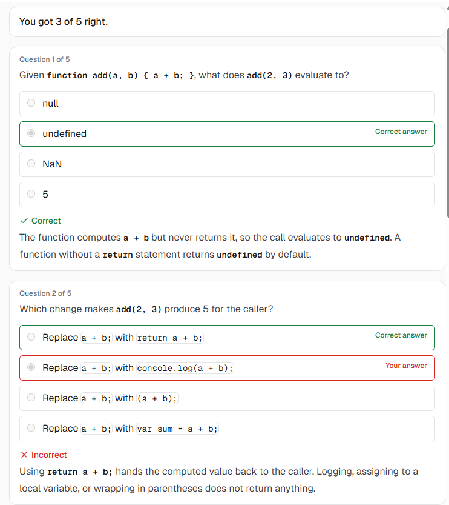

# AI Tutor

AI Tutor is an AI-powered web tutor for developers. It guides code problem-solving in a chat and
generates interactive quizzes from that chat. Instead of handing over a full solution, the tutor
asks guiding questions and gives hints, unless you explicitly ask for the solution. It is a local
project: you run the backend and the frontend on your own machine.

## What it does
- **Guiding chat.** You describe a bug or a concept, and the tutor answers with a question or a
  hint. The reply streams in as it is written and renders as Markdown with code blocks.
- **Quiz from the chat.** After the first exchange, "Generate Quiz" builds a quiz of 5 questions
  with 4 options each, about what the chat covered. You answer, check your score, see why each
  correct option is right, retake the quiz, or go back to the chat unchanged.
- **Clear failures.** If the API or the network fails, a short message is shown and the chat and
  your typed text stay as they were.

## Screenshots




## How it is built
- `frontend/` — a Next.js app (React, TypeScript, Tailwind CSS). It talks only to the backend.
- `backend/` — a small Express proxy (Node.js, TypeScript) to the Anthropic API. It adds the
  tutor's system prompt, streams chat replies, and checks every quiz against a strict schema.

**API key:** the backend needs an Anthropic API key in the variable `ANTHROPIC_API_KEY`. It lives
only in `backend/.env`, which is gitignored. The frontend never sees the key: the browser sends
every request to the local backend, never to Anthropic directly.

## Run it locally
Requirements: Node.js 22.12 or later, and an Anthropic API key from the
[Anthropic Console](https://console.anthropic.com/).

Full setup, configuration, and scripts are in [`backend/README.md`](backend/README.md) and
[`frontend/README.md`](frontend/README.md). In short, after `npm ci` in each folder and creating
`backend/.env` from `backend/.env.example`, use two terminals:

```powershell
# Terminal 1
cd backend
npm run dev
```

```powershell
# Terminal 2
cd frontend
npm run dev
```

The backend listens on `http://127.0.0.1:4000` (change it with `PORT` in `backend/.env`).

Then open http://localhost:3000 (use `localhost`, not `127.0.0.1`; the backend's CORS setting
allows that origin only). Run the tests with `npm test` in either folder; they mock the network
and need no API key.

## Repository layout
| Path | Purpose |
|---|---|
| `frontend/` | The Next.js app (browser UI). |
| `backend/` | The Express proxy to the Anthropic API. The only place the API key is used. |
| `.doc/` | Product definition, architecture (including the API contract), and glossary. |
| `.plan/` | `000-backlog.md` is the task queue; `NNN-YYYY-MM-DD-*.md` are the implementation plans. |
| `.claude/rules/` | Always-on constraints: code style, naming, UI and styling, git workflow. |
| `.claude/skills/` | Procedural know-how, loaded by task (plans, tests, error handling). |
| `.claude/agents/` | Sub-agent definitions. |
| `.claude/hooks/` | Guardrail hooks, wired by `.claude/settings.json`. |
| `.orchestrate/` | Files generated by agents; gitignored except its README. |
| `AGENTS.md` | Rules, guardrails, and layout for AI coding agents; `CLAUDE.md` imports it. |
| `.cursor/`, `.github/` | Pointers that send Cursor and GitHub Copilot to `AGENTS.md`. |

## How the work is done
Every change starts as an item in `.plan/000-backlog.md` and gets a written plan in `.plan/`, with
open questions, steps, and a validation checklist, which the owner approves before any code is
written. Each plan runs on its own branch, one step at a time, with an AI coding agent doing the
work and guardrail hooks blocking commits, merges, and pushes. The owner reviews each step and
makes every commit and merge.

## License
MIT. See [`LICENSE`](LICENSE).
